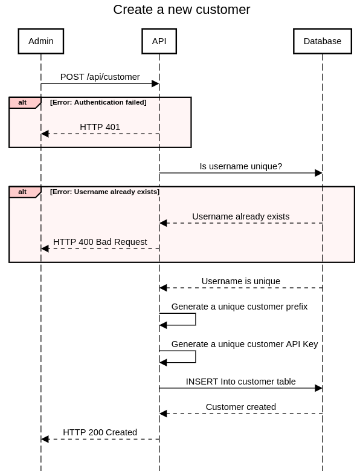
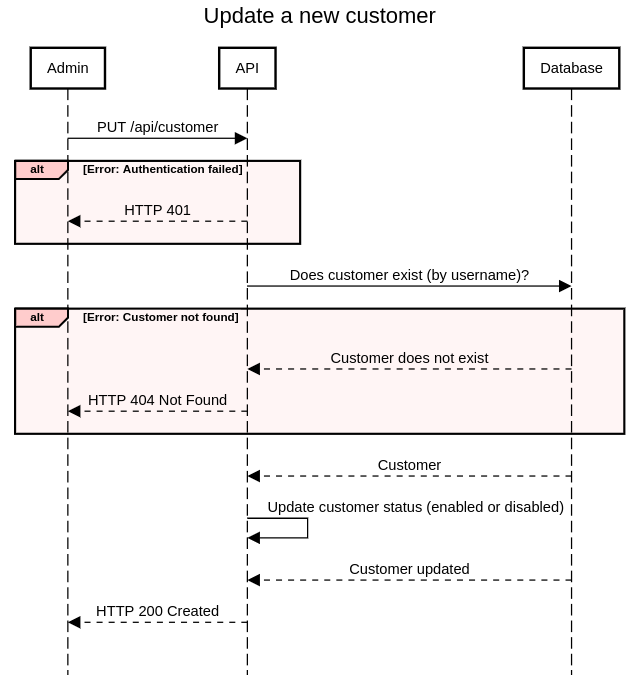
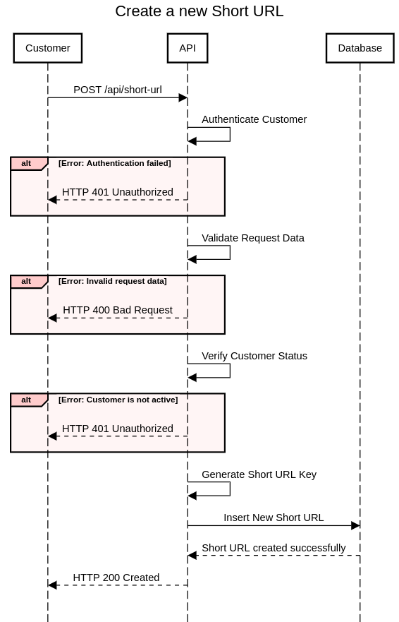
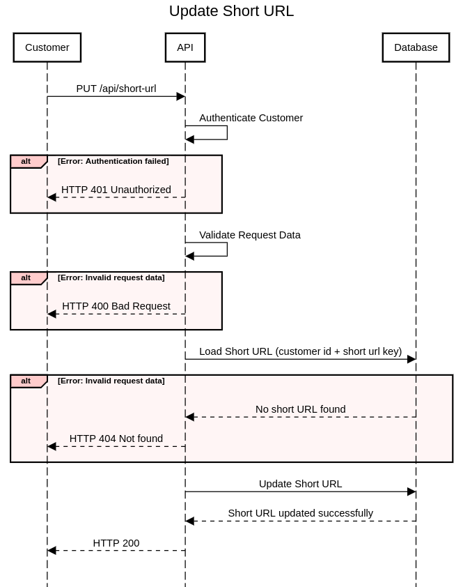
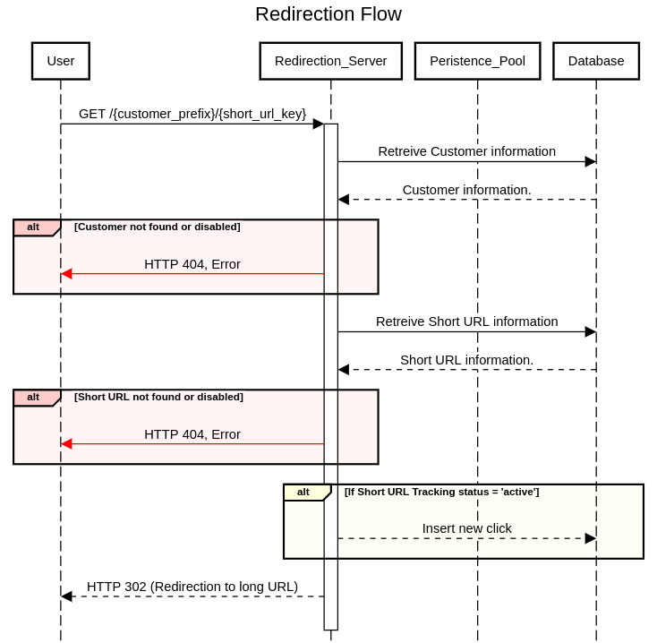
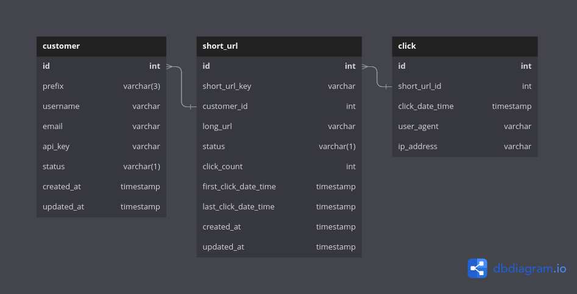

# Design and Architecture

## Architecture 
- There are 2 main components in this system
    - API Server
    - Redirection Server
- API Server is the main server that handle all the API requests from the admin or customers
- Redirection Server is the server that handle all the redirection requests from the public
- The separation between the two components has two benefits : 
    - The servers can be scaled independently of each other.
    - Security: The API server is not exposed to public users, it's only used by authenticated users. The redirection server is exposed to public users, it doesn't require authentication, but it doesn't modify customer and short URL data, it only reads data, and inserts tracking data.

<p align="center"></p>

## API Server
- The API server is the main server that handle all the API requests from the admin and customers.
- The API server is a REST API server, it's built using Golang & Swagger.
- The API server is stateless, it doesn't store any data, it only reads and writes data to the database.
- The API server is secured using API key. Each customer has an API key stored in the database, and the admin has a specific API key stored as an environment variable.

### Simple random string generation algorithm : 
- The random alphanumerics (a-z, A-Z and 0-9) string generator is a function that generates a random alphanumeric string of n characters.
- This function will be used to generate the customer prefix (3 characters), the short URL key (6 characters), and the API key (32 characters).
- To guarantee unicity, the generated key will be checked against the database, if it already exists, a new key will be generated and checked again, until a unique key is found.

```go
...
func generateRandomString(n int) string {
	r := rand.New(rand.NewSource(time.Now().UnixNano()))
	b := make([]rune, n)
	for i := range b {
		b[i] = alphanums[r.Intn(len(alphanums))]
	}
	return string(b)
}
```


### 1. Create Customer:
#### 1.1. Sequence diagram:
<p align="center"></p>

#### 1.2. Endpoint details :
   - Endpoint: `/api/customer/`
   - HTTP Method: POST
   - Header Parameters:
     - `X-API-KEY`: The admin API key.
   - Request JSON Structure:
     ```json
     {
       "username": "string", 
       "email": "string" 
     }
     ```
      - 'username' and 'email' are required.
      - 'username' must be unique.

   - Response JSON Structure (on success):
     ```json
     {
       "api_key": "string",
       "prefix": "string"
     }
     ```
   - Response JSON Structure (on failure):
     ```json
     {
       "error": "string",
     }
     ```
#### 1.3. Example request in curl :
  ```bash
  curl -X POST \
  -H "Content-Type: application/json" \
  -H "X-API-KEY: {admin_api_key}" \
  -d '{
    "username": "johnsmith",
    "email": "johnsmith@example.com"
  }' \
  https://your-domain.com/api/customer/

  ```

### 2. Update Customer:
#### 2.1. Sequence diagram:
<p align="center"></p>

#### 2.2. Endpoint details :
   - Endpoint: `/api/customer/`
   - HTTP Method: PUT
   - Header Parameters:
      - `X-API-KEY`: The admin API key.
   - Request JSON Structure:
     ```json
     {
       "username": "string",
       "status": "string" 
     }
     ```
     - 'username' is required.
     - 'status' is required and must be one of the possible values : "active" or "inactive".
   - Response JSON Structure (on success):
     ```json
     {
       "status": "string"
     }
     ```
   - Response JSON Structure (on failure):
     ```json
     {
       "error": "string",
     }
     ```
#### 2.3. Example request in curl: 
```bash
  curl -X PUT \
  -H "Content-Type: application/json" \
  -H "X-API-KEY: {admin_api_key}" \
  -d '{
    "username": "johnsmith",
    "status": "inactive"
  }' \
  https://your-domain.com/api/customer/
  ```
### 3. Create ShortURL:
#### 3.1. Sequence diagram:
<p align="center"></p>

#### 3.2. Endpoint details :
   - Endpoint: `/api/short-url/`
   - HTTP Method: POST
   - Header Parameters:
     - `X-API-KEY`: The customer API key.
   - Request JSON Structure:
     ```json
     {
       "long_url": "string" 
     }
     ```
     - 'long_url' is required and must be a valid URL.
   - Response JSON Structure (on success):
     ```json
     {
       "short_url_key": "string",
       "short_url": "string"
     }
     ```
   - Response JSON Structure (on failure):
      ```json
      {
        "error": "string",
      }
      ```
#### 3.3. Example request in curl: 
 ```bash
  curl -X POST \
  -H "Content-Type: application/json" \
  -H "X-API-KEY: {customer_api_key}" \
  -d '{
    "long_url": "https://www.example.com"
  }' \
  https://your-domain.com/api/short-url/
  ```

### 4. Update ShortURL:
#### 4.1. Sequence diagram:
<p align="center"></p>

#### 4.2. Endpoint details :
   - Endpoint: `/api/short-url/`
   - HTTP Method: PUT
   - Header Parameters:
      - `X-API-KEY`: The customer API key.
   - Request JSON Structure:
     ```json
     {
       "short_url_key": "string", 
       "new_long_url": "string", 
       "status": "string",
       "tracking_status": "string",
     }
     ```
     - 'short_url_key' is required.
     - 'new_long_url' is optional, if it's not provided, the long url will not be updated.
     - 'status' is optional, if it's not provude=ed, the status will not be updated. Possible values: "active", "inactive".
     - 'tracking_status' is optional, if it's not provided, the tracking status will not be updated. Possible values: "active", "inactive".
    - Response JSON Structure (on success):
     ```json
     {
       "long_url": "string",
       "status": "string", 
       "tracking_status": "string"
     }
     ```
    - Response JSON Structure (on failure):
      ```json
      {
        "error": "string",
      }
      ```
#### 4.3. Example request in curl: 
```bash
  curl -X PUT \
  -H "Content-Type: application/json" \
  -H "X-API-KEY: {customer_api_key}" \
  -d '{
    "short_url_key": "https://your-domain.com/abcd123",
    "new_long_url": "https://www.example.com/new",
    "tracking_status": "inactive"
  }' \
  https://your-domain.com/api/short-url/
  ```
  Please note that you need to replace `{admin_api_key}` and `{customer_api_key}` with the actual API keys for authentication. Also, replace https://your-domain.com with the appropriate URL for your API endpoint.

## Redirection Server
- The redirection server is the server that handle all the redirection requests from the public.
- The redirection server is an http server, it's built using Golang & **GoFiber** (a fast HTTP framework).
- The redirection server is stateless, it doesn't store any data locally, it only reads and stores data from and to the database, which make it easy to scale.
- It exposes a unique endpoint `https://<domain.name>/{customer_prefix}/{short_url_key}`
- The end point has 2 functions: 
    - Redirect the user to the destination URL.
    - Persist the click information in the database.
- The persistence of the click information is done asynchronously, so that the redirection is not delayed by the database operations, by using a channel and a pool of workers (goroutines).
- The size of the persistence worker pool can be configured using an environment variable.
- The storage operation consists of two write operations:
    - Insert a new line in the `Click` table.
    - Update 3 agregates in `Short URL` table : increment the `Click Count` column, set `First Click Date Time` column (optionally), update `Last Click Date and Time` column.

- The following sequence diagram shows the flow of the redirection request:
<p align="center"></p>
## Database Design
- The database is a relational database (PostgreSql).
- The database has 3 tables:
    - `customers` table
    - `short_urls` table
    - `clicks` table

<p align="center"></p>

### Indexes List
Here's the list of non-primary key indexes that will enhance the performance of the data access layer:
- `customers` table:
    - `prefix` column
    - `username` column
    - `api_key` column

- `short_urls` table:
    - `customer_id` column
    - `short_url_key` and `customer_id` columns (unique index)

- `clicks` table:
    - `short_url_id` column

### Creation scripts
Here's the PostgreSql script to create the database and tables:

```sql
CREATE TABLE "customers" (
  "id" int PRIMARY KEY,
  "prefix" varchar(3) UNIQUE NOT NULL,
  "username" varchar UNIQUE NOT NULL,
  "email" varchar UNIQUE NOT NULL,
  "api_key" varchar UNIQUE NOT NULL,
  "status" varchar(1) NOT NULL DEFAULT 'e',
  "created_at" timestamp DEFAULT (now()),
  "updated_at" timestamp
);

CREATE TABLE "short_urls" (
  "id" int PRIMARY KEY,
  "short_url_key" varchar,
  "customer_id" int NOT NULL,
  "long_url" varchar NOT NULL,
  "status" varchar(1) DEFAULT 'e',
  "tracking_status" varchar(1) DEFAULT 'e',
  "click_count" int DEFAULT 0,
  "first_click_date_time" timestamp,
  "last_click_date_time" timestamp,
  "created_at" timestamp DEFAULT (now()),
  "updated_at" timestamp
);

CREATE TABLE "clicks" (
  "id" int PRIMARY KEY,
  "short_url_id" int NOT NULL,
  "click_date_time" timestamp DEFAULT (now()),
  "user_agent" varchar,
  "ip_address" varchar
);

CREATE INDEX ON "customers" ("prefix");

CREATE INDEX ON "customers" ("username");

CREATE INDEX ON "customers" ("api_key");

CREATE INDEX ON "short_urls" ("customer_id");

CREATE UNIQUE INDEX ON "short_urls" ("short_url_key", "customer_id");

CREATE INDEX ON "clicks" ("short_url_id");

COMMENT ON TABLE "customers" IS 'Table holding Customer information';

COMMENT ON COLUMN "customers"."prefix" IS '3 characters, case-sensitive';

COMMENT ON COLUMN "customers"."api_key" IS 'API key';

COMMENT ON COLUMN "customers"."status" IS 'e: enabled, d: disabled';

COMMENT ON COLUMN "customers"."created_at" IS 'Timestamp of creation';

COMMENT ON COLUMN "customers"."updated_at" IS 'Timestamp of last update';

COMMENT ON TABLE "short_urls" IS 'Table holding short URL information';

COMMENT ON COLUMN "short_urls"."short_url_key" IS '6 characters, case-sensitive';

COMMENT ON COLUMN "short_urls"."status" IS 'e: enabled, d: disabled';

COMMENT ON COLUMN "short_urls"."tracking_status" IS 'e: enabled, d: disabled';

COMMENT ON COLUMN "short_urls"."click_count" IS 'Aggregate updated by the redirection server';

COMMENT ON COLUMN "short_urls"."first_click_date_time" IS 'Aggregate set by the redirection server';

COMMENT ON COLUMN "short_urls"."last_click_date_time" IS 'Aggregate set by the redirection server';

COMMENT ON COLUMN "short_urls"."created_at" IS 'Timestamp of creation';

COMMENT ON COLUMN "short_urls"."updated_at" IS 'Timestamp of last update';

COMMENT ON TABLE "clicks" IS 'Table holding click information';

COMMENT ON COLUMN "clicks"."click_date_time" IS 'Timestamp of click';

ALTER TABLE "short_urls" ADD FOREIGN KEY ("customer_id") REFERENCES "customers" ("id");

ALTER TABLE "clicks" ADD FOREIGN KEY ("short_url_id") REFERENCES "short_urls" ("id");
```

## Database Access Layer Queries
- Here's the list of queries that constitute the data access layer.
- The queries are written in SQLC, which is a tool that generates type-safe Go code from SQL.

### Query 1: Check if username exists:
```sql
-- name: CheckUsernameExists
SELECT EXISTS(SELECT 1 FROM customers WHERE username = $1);
```

### Query 2: Check if email exists:
```sql
-- name: CheckEmailExists
SELECT EXISTS(SELECT 1 FROM customers WHERE email = $1);
```

### Query 3: Check if api_key exists:
```sql
-- name: CheckApiKeyExists
SELECT EXISTS(SELECT 1 FROM customers WHERE api_key = $1);
```

### Query 4: Insert a new customer:
```sql
-- name: InsertNewCustomer
INSERT INTO customers (id, prefix, username, email, api_key, status, created_at, updated_at)
VALUES ($1, $2, $3, $4, $5, $6, $7, $8)
RETURNING id, prefix, username, email, api_key, status, created_at, updated_at;
```

### Query 5: Update customer status by username:
```sql
-- name: UpdateCustomerStatusByUsername
UPDATE customers SET status = $1 WHERE username = $2
RETURNING id, prefix, username, email, api_key, status, created_at, updated_at;
```

### Query 6: Update customer status by prefix:
```sql
-- name: UpdateCustomerStatusByPrefix
UPDATE customers SET status = $1 WHERE prefix = $2
RETURNING id, prefix, username, email, api_key, status, created_at, updated_at;
```

### Query 7: Update customer status by api_key:
```sql
-- name: UpdateCustomerStatusByApiKey
UPDATE customers SET status = $1 WHERE api_key = $2
RETURNING id, prefix, username, email, api_key, status, created_at, updated_at;
```

### Query 8: Get customer by username:
```sql
-- name: GetCustomerByUsername
SELECT id, prefix, username, email, api_key, status, created_at, updated_at
FROM customers WHERE username = $1;
```

### Query 9: Get customer by prefix:
```sql
-- name: GetCustomerByPrefix
SELECT id, prefix, username, email, api_key, status, created_at, updated_at
FROM customers WHERE prefix = $1;
```

### Query 10: Get customer by api_key:
```sql
-- name: GetCustomerByApiKey
SELECT id, prefix, username, email, api_key, status, created_at, updated_at
FROM customers WHERE api_key = $1;
```


### Query 11:  Check if short_url_key exists for a specific customer_id:
```sql
-- name: CheckShortUrlKeyExists
SELECT EXISTS(SELECT 1 FROM short_urls WHERE short_url_key = $1 AND customer_id = $2);
```

### Query 12: Insert a new short URL:
```sql
-- name: InsertNewShortURL
INSERT INTO short_urls (id, short_url_key, customer_id, long_url, status, click_count, first_click_date_time, last_click_date_time, created_at, updated_at)
VALUES ($1, $2, $3, $4, $5, $6, $7, $8, $9, $10)
RETURNING id, short_url_key, customer_id, long_url, status, click_count, first_click_date_time, last_click_date_time, created_at, updated_at;
```

### Query 13: Update short URL status:
```sql
-- name: UpdateShortURLStatus
UPDATE short_urls SET status = $1 WHERE short_url_key = $2 AND customer_id = $3
RETURNING id, short_url_key, customer_id, long_url, status, click_count, first_click_date_time, last_click_date_time, created_at, updated_at;
```

### Query 14: Update short URL long URL:
```sql
-- name: UpdateShortURLLongURL
UPDATE short_urls SET long_url = $1 WHERE short_url_key = $2 AND customer_id = $3
RETURNING id, short_url_key, customer_id, long_url, status, click_count, first_click_date_time, last_click_date_time, created_at, updated_at;
```

### Query 15:  Increment short URL click count:
```sql
-- name: IncrementShortURLClickCount
UPDATE short_urls SET click_count = click_count + 1 WHERE short_url_key = $1 AND customer_id = $2
RETURNING id, short_url_key, customer_id, long_url, status, click_count, first_click_date_time, last_click_date_time, created_at, updated_at;
```

### Query 16: Set short URL first click date:
```sql
-- name: SetShortURLFirstClickDate
UPDATE short_urls SET first_click_date_time = $1 WHERE short_url_key = $2 AND customer_id = $3
RETURNING id, short_url_key, customer_id, long_url, status, click_count, first_click_date_time, last_click_date_time, created_at, updated_at;
```

### Query 17: Set short URL last click date:
```sql
-- name: SetShortURLLastClickDate
UPDATE short_urls SET last_click_date_time = $1 WHERE short_url_key = $2 AND customer_id = $3
RETURNING id, short_url_key, customer_id, long_url, status, click_count, first_click_date_time, last_click_date_time, created_at, updated_at;
```

### Query 18: Get short URL by customer_id and short_url_key:
```sql
-- name: GetShortURLByCustomerIDAndShortURLKey
SELECT id, short_url_key, customer_id, long_url, status, click_count, first_click_date_time, last_click_date_time, created_at, updated_at
FROM short_urls WHERE customer_id = $1 AND short_url_key = $2;
```

### Query 19:  Insert a new click:
```sql
-- name: InsertNewClick
INSERT INTO clicks (id, short_url_id, click_date_time, user_agent, ip_address)
VALUES ($1, $2, $3, $4, $5);
```

