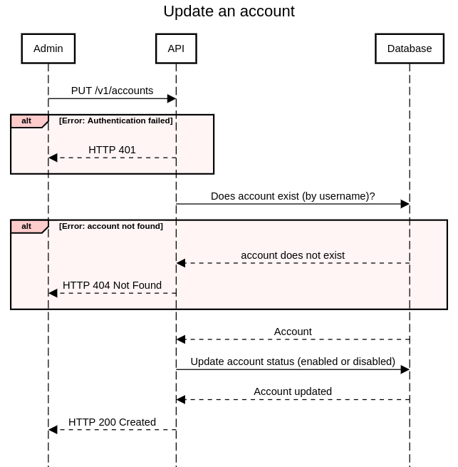

# Design and Architecture

## Architecture 
- There are 2 main components in this system
    - AdminAPI Server
    - Redirection Server
- AdminAPI Server is the main server that handles all the API requests from the admin or account users
- Redirection Server is the server that handle all the redirection requests from the public users
- Both servers run on HTTP. Securing the communication between the servers and the clients is done using HTTPS, and it is delegated to a reverse proxy that handles the SSL/TLS.
- The separation between the two components has two benefits : 
    - The servers can be scaled independently of each other.
    - Security: The AdminAPI server is not exposed to public users, it's only used by authenticated users. The redirection server is exposed to public users, it doesn't require authentication, but it doesn't modify Account and URL data, it only reads this data, and inserts tracking data (clicks).
- For the sake of simplicity both components share the same database (Postgres).

<p align="center"></p>

## Admin API Server
- The AdminAPI server is the main server that handle all the API requests from the admin and account users.
- .. is a REST server, it's built using Golang & Swagger.
- .. is stateless, it doesn't store any data, it only reads and writes data to the database.
- .. is secured using API key & JWT. Each account has an API key stored in the database, and the admin has a specific API key stored as an environment variable.

### Simple random string generation algorithm : 
- The random alphanumerics (a-z, A-Z and 0-9) string generator is a function that generates a random alphanumeric string of n characters.
- This function will be used to generate the account prefix of 3 characters (which gives 62^3 possibilities), the short URL key (6 characters), and the API key (32 characters).
- To guarantee unicity, the generated key will be checked against the database, if it already exists, a new key will be generated and checked again, until a unique key is found.

```go
...
func generateRandomString(n int) string {
	r := rand.New(rand.NewSource(time.Now().UnixNano()))
	b := make([]rune, n)
	for i := range b {
		b[i] = alphanums[r.Intn(len(alphanums))]
	}
	return string(b)
}
```


### 1. Create Account:
#### 1.1. Sequence diagram:
<p align="center"></p>

#### 1.2. Endpoint details :
   - Endpoint: `/v1/accounts`
   - HTTP Method: POST
   - Header Parameters:
     - `Authorization`: The admin API key.
   - Request JSON Structure:
     ```json
     {
       "username": "string", 
       "email": "string" 
     }
     ```
      - 'username' and 'email' are required.
      - 'username' must be unique.

   - Response JSON Structure (on success):
     ```json
     {
       "api_key": "string",
       "prefix": "string"
     }
     ```
   - Response JSON Structure (on failure):
     ```json
     {
       "error": "string",
     }
     ```
#### 1.3. Example request in curl :
  ```bash
  curl -X POST \
  -H "Content-Type: application/json" \
  -H "Authorization: Bearer <JWT>" \
  -d '{
    "username": "johnsmith",
    "email": "johnsmith@example.com"
  }' \
  https://your-domain.com/v1/accounts/

  ```

### 2. Update Account:
#### 2.1. Sequence diagram:
<p align="center"></p>

#### 2.2. Endpoint details :
   - Endpoint: `/v1/accounts`
   - HTTP Method: PUT
   - Header Parameters:
      - `Authorization`: The admin API key.
   - Request JSON Structure:
     ```json
     {
       "username": "string",
       "status": "string" 
     }
     ```
     - 'username' is required.
     - 'status' is required and must be one of the possible values : "active" or "inactive".
   - Response JSON Structure (on success):
     ```json
     {
       "status": "string"
     }
     ```
   - Response JSON Structure (on failure):
     ```json
     {
       "error": "string",
     }
     ```
#### 2.3. Example request in curl: 
```bash
  curl -X PUT \
  -H "Content-Type: application/json" \
  -H "Authorization: Bearer <JWT>" \
  -d '{
    "username": "johnsmith",
    "status": "inactive"
  }' \
  https://your-domain.com/v1/accounts
  ```
### 3. Create ShortURL:
#### 3.1. Sequence diagram:
<p align="center"></p>

#### 3.2. Endpoint details :
   - Endpoint: `/v2/links/`
   - HTTP Method: POST
   - Header Parameters:
     - `Authorization`: The account API key.
   - Request JSON Structure:
     ```json
     {
       "long_url": "string" 
     }
     ```
     - 'long_url' is required and must be a valid URL.
   - Response JSON Structure (on success):
     ```json
     {
       "short_url_key": "string",
       "short_url": "string"
     }
     ```
   - Response JSON Structure (on failure):
      ```json
      {
        "error": "string",
      }
      ```
#### 3.3. Example request in curl: 
 ```bash
  curl -X POST \
  -H "Content-Type: application/json" \
  -H "Authorization: Bearer <JWT>" \
  -d '{
    "long_url": "https://www.example.com"
  }' \
  https://your-domain.com/v2/links/
  ```

### 4. Update ShortURL:
#### 4.1. Sequence diagram:
<p align="center"></p>

#### 4.2. Endpoint details :
   - Endpoint: `/v2/links/`
   - HTTP Method: PUT
   - Header Parameters:
      - `Authorization`: The account API key.
   - Request JSON Structure:
     ```json
     {
       "short_url_key": "string", 
       "new_long_url": "string", 
       "status": "string",
       "tracking_status": "string",
     }
     ```
     - 'short_url_key' is required.
     - 'new_long_url' is optional, if it's not provided, the long url will not be updated.
     - 'status' is optional, if it's not provude=ed, the status will not be updated. Possible values: "active", "inactive".
     - 'tracking_status' is optional, if it's not provided, the tracking status will not be updated. Possible values: "active", "inactive".
   - Response JSON Structure (on success):
     ```json
     {
       "long_url": "string",
       "status": "string", 
       "tracking_status": "string"
     }
     ```
    - Response JSON Structure (on failure):
      ```json
      {
        "error": "string",
      }
      ```
#### 4.3. Example request in curl: 
```bash
  curl -X PUT \
  -H "Content-Type: application/json" \
  -H "Authorization: Bearer <JWT>" \
  -d '{
    "short_url_key": "https://your-domain.com/abcd123",
    "new_long_url": "https://www.example.com/new",
    "tracking_status": "inactive"
  }' \
  https://your-domain.com/v2/links/
  ```
  Please note that you need to replace `<JWT>` with the actual JWT token generated with in the login step. Also, replace https://your-domain.com with the appropriate URL for your API endpoint.

## Redirection Server
- The redirection server is the server that handle all the redirection requests from the public.
- The redirection server is an http server, it's built using Golang & **GoFiber** (a fast HTTP framework).
- The redirection server is stateless, it doesn't store any data locally, it only reads and stores data from and to the database, which make it easy to scale.
- It exposes a unique endpoint `https://<domain.name>/{account_prefix}/{short_url_key}`
- The end point has 2 functions: 
    - Redirect the user to the destination URL.
    - Persist the click information in the database.
- Error pages are to be configured in environment variables, so that the redirection server can return the appropriate error page in case of error, there are 2 error pages :
    - 404 Not Found (To be stored in the environment variable: `REDIRECTION_SERVER_404_PAGE`)
    - 500 Internal Server Error (To be stored in the environment variable: `REDIRECTION_SERVER_500_PAGE`)

- The following sequence diagram shows the flow of the redirection request:
<p align="center"></p>

## Database Design
- The database is a relational database (PostgreSql).
- The database has 3 tables:
    - `accounts` table
    - `short_urls` table
    - `clicks` table

<p align="center"></p>

### Indexes List
Here's the list of non-primary key indexes that will enhance the performance of the data access layer:
- `accounts` table:
    - `prefix` column
    - `username` column
    - `api_key` column

- `short_urls` table:
    - `account_id` column
    - `short_url_key` and `account_id` columns (unique index)

- `clicks` table:
    - `short_url_id` column

### Creation scripts
Here's the PostgreSql script to create the database and tables:

```sql
CREATE TABLE "account" (
  "id" INT GENERATED BY DEFAULT AS IDENTITY PRIMARY KEY,
  "prefix" varchar(3) UNIQUE NOT NULL,
  "username" varchar UNIQUE NOT NULL,
  "email" varchar NOT NULL,
  "hashed_password" varchar UNIQUE NOT NULL,
  "enabled" bool NOT NULL DEFAULT true,
  "created_at" timestamp DEFAULT (now()),
  "updated_at" timestamp
);

CREATE TABLE "link" (
  "id" INT GENERATED BY DEFAULT AS IDENTITY PRIMARY KEY,
  "short_url_key" varchar,
  "account_id" int NOT NULL,
  "long_url" varchar NOT NULL,
  "enabled" boolean NOT NULL DEFAULT true,
  "tracking_enabled" boolean NOT NULL DEFAULT true,
  "created_at" timestamp DEFAULT (now()),
  "updated_at" timestamp
);

CREATE TABLE "click" (
  "id" INT GENERATED BY DEFAULT AS IDENTITY PRIMARY KEY,
  "link_id" int NOT NULL,
  "click_date_time" timestamp DEFAULT (now()),
  "user_agent" varchar,
  "ip_address" varchar
);

CREATE INDEX ON "account" ("prefix");

CREATE INDEX ON "account" ("username");

CREATE INDEX ON "link" ("account_id");

CREATE UNIQUE INDEX ON "link" ("short_url_key", "account_id");

CREATE INDEX ON "click" ("link_id");

COMMENT ON TABLE "account" IS 'Table holding Account information';

COMMENT ON COLUMN "account"."prefix" IS '3 characters, case-sensitive';

COMMENT ON COLUMN "account"."hashed_password" IS 'Hashed password';

COMMENT ON COLUMN "account"."enabled" IS 'A flag that enables/disables the account and its urls';

COMMENT ON COLUMN "account"."created_at" IS 'Timestamp of creation';

COMMENT ON COLUMN "account"."updated_at" IS 'Timestamp of last update';

COMMENT ON TABLE "link" IS 'Table holding Link information';

COMMENT ON COLUMN "link"."short_url_key" IS '6 characters, case-sensitive';

COMMENT ON COLUMN "link"."enabled" IS 'A flag to enable/disable the url redirection';

COMMENT ON COLUMN "link"."tracking_enabled" IS 'A flag that enable/disable url tracking on redirection';

COMMENT ON COLUMN "link"."created_at" IS 'Timestamp of creation';

COMMENT ON COLUMN "link"."updated_at" IS 'Timestamp of last update';

COMMENT ON TABLE "click" IS 'Table holding click information';

COMMENT ON COLUMN "click"."click_date_time" IS 'Timestamp of click';

ALTER TABLE "link" ADD FOREIGN KEY ("account_id") REFERENCES "account" ("id");

ALTER TABLE "click" ADD FOREIGN KEY ("link_id") REFERENCES "link" ("id");
```

## Database Access Layer Queries
- The queries are written in SQLC, which is a tool that generates type-safe Go code from SQL.

