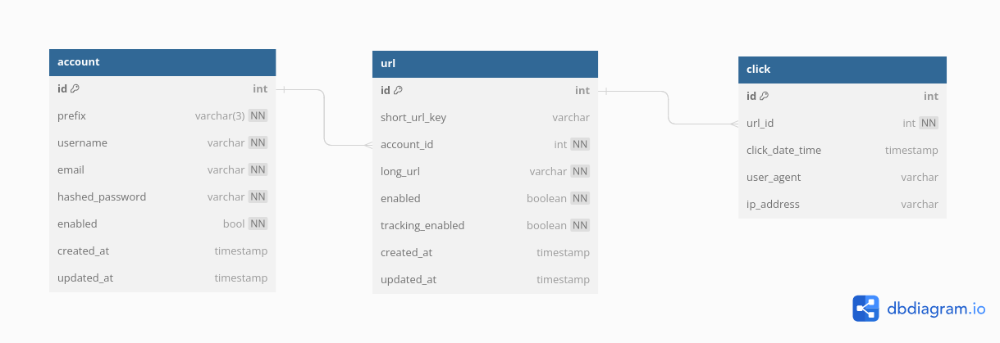

# Design and Architecture

## Architecture 
- There are 2 main components in this system
    - API Server
    - Redirection Server
- API Server is the main server that handle all the API requests from the admin or customers
- Redirection Server is the server that handle all the redirection requests from the public
- The separation between the two components has two benefits : 
    - The servers can be scaled independently of each other.
    - Security: The API server is not exposed to public users, it's only used by authenticated users. The redirection server is exposed to public users, it doesn't require authentication, but it doesn't modify customer and short URL data, it only reads data, and inserts tracking data.

<p align="center"></p>

## API Server
- The API server is the main server that handle all the API requests from the admin and customers.
- The API server is a REST API server, it's built using Golang & Swagger.
- The API server is stateless, it doesn't store any data, it only reads and writes data to the database.
- The API server is secured using API key. Each customer has an API key stored in the database, and the admin has a specific API key stored as an environment variable.

### Simple random string generation algorithm : 
- The random alphanumerics (a-z, A-Z and 0-9) string generator is a function that generates a random alphanumeric string of n characters.
- This function will be used to generate the customer prefix (3 characters), the short URL key (6 characters), and the API key (32 characters).
- To guarantee unicity, the generated key will be checked against the database, if it already exists, a new key will be generated and checked again, until a unique key is found.

```go
...
func generateRandomString(n int) string {
	r := rand.New(rand.NewSource(time.Now().UnixNano()))
	b := make([]rune, n)
	for i := range b {
		b[i] = alphanums[r.Intn(len(alphanums))]
	}
	return string(b)
}
```

### API Endpoints
Here's a brief description of the API endpoints:
1. Create Customer:
   - Endpoint: `/api/customer/`
   - HTTP Method: POST
   - Header Parameters:
     - `X-API-KEY`: The admin API key.
   - Request JSON Structure:
     ```json
     {
       "username": "string", 
       "email": "string" 
     }
     ```
      - 'username' and 'email' are required and must be unique.

   - Response JSON Structure (on success):
     ```json
     {
       "api_key": "string",
     }
     ```
   - Response JSON Structure (on failure):
     ```json
     {
       "error": "string",
     }
     ```

2. Update Customer:
   - Endpoint: `/api/customer/`
   - HTTP Method: PUT
   - Header Parameters:
      - `X-API-KEY`: The admin API key.
   - Request JSON Structure:
     ```json
     {
       "username": "string",
       "status": "string" 
     }
     ```
     - 'username' is required.
     - 'status' is required and must be one of the possible values : "active" or "inactive".
   - Response JSON Structure (on success):
     ```json
     {
       "status": "string"
     }
     ```
   - Response JSON Structure (on failure):
     ```json
     {
       "error": "string",
     }
     ```

3. Create ShortURL:
   - Endpoint: `/api/short-url/`
   - HTTP Method: POST
   - Header Parameters:
     - `X-API-KEY`: The customer API key.
   - Request JSON Structure:
     ```json
     {
       "long_url": "string" 
     }
     ```
     - 'long_url' is required and must be a valid URL.
   - Response JSON Structure (on success):
     ```json
     {
       "short_url": "string"
     }
     ```
    - Response JSON Structure (on failure):
      ```json
      {
        "error": "string",
      }
      ```

4. Update ShortURL:
   - Endpoint: `/api/short-url/`
   - HTTP Method: PUT
   - Header Parameters:
      - `X-API-KEY`: The customer API key.
   - Request JSON Structure:
     ```json
     {
       "short_url": "string", 
       "new_long_url": "string", 
       "tracking_status": "string",
     }
     ```
     - 'short_url' is required.
     - 'new_long_url' is optional, if it's not provided, the long url will not be updated.
     - 'tracking_status' is optional, if it's not provided, the tracking status will not be updated. Possible values: "active", "inactive".
   - Response JSON Structure (on success):
     ```json
     {
       "status": "string"
     }
     ```
    - Response JSON Structure (on failure):
      ```json
      {
        "error": "string",
      }
      ```
### Example requests in curl 
  1. Create Customer:
  ```bash
  curl -X POST \
  -H "Content-Type: application/json" \
  -H "X-API-KEY: {admin_api_key}" \
  -d '{
    "username": "johnsmith",
    "email": "johnsmith@example.com"
  }' \
  https://your-domain.com/api/customer/

  ```
  
  2. Update Customer:
  ```bash
  curl -X PUT \
  -H "Content-Type: application/json" \
  -H "X-API-KEY: {admin_api_key}" \
  -d '{
    "username": "johnsmith",
    "status": "inactive"
  }' \
  https://your-domain.com/api/customer/
  ```
  
  3. Create ShortURL:
  ```bash
  curl -X POST \
  -H "Content-Type: application/json" \
  -H "X-API-KEY: {customer_api_key}" \
  -d '{
    "long_url": "https://www.example.com"
  }' \
  https://your-domain.com/api/short-url/
  ```

  4. Update ShortURL:
  ```bash
  curl -X PUT \
  -H "Content-Type: application/json" \
  -H "X-API-KEY: {customer_api_key}" \
  -d '{
    "short_url": "https://your-domain.com/abcd123",
    "new_long_url": "https://www.example.com/new",
    "tracking_status": "inactive"
  }' \
  https://your-domain.com/api/short-url/
  ```

  Please note that you need to replace `{admin_api_key}` and `{customer_api_key}` with the actual API keys for authentication. Also, replace https://your-domain.com with the appropriate URL for your API endpoint.

## Redirection Server
- The redirection server is the server that handle all the redirection requests from the public.
- The redirection server is an http server, it's built using Golang & **GoFiber** (a fast HTTP framework).
- The redirection server is stateless, it doesn't store any data locally, it only reads and stores data from and to the database, which make it easy to scale.
- It exposes a unique endpoint `https://<domain.name>/{customer_prefix}/{short_url_key}`
- The end point has 2 functions: 
    - Redirect the user to the destination URL.
    - Persist the click information in the database.
- The persistence of the click information is done asynchronously, so that the redirection is not delayed by the database operations, by using a channel and a pool of workers (goroutines).
- The size of the persistence worker pool can be configured using an environment variable.
- The storage operation consists of two write operations:
    - Insert a new line in the `Click` table.
    - Update 3 agregates in `Short URL` table : increment the `Click Count` column, set `First Click Date Time` column (optionally), update `Last Click Date and Time` column.

## Database Design
- The database is a relational database (PostgreSql).
- The database has 3 tables:
    - `customer` table
    - `short_url` table
    - `click` table

<p align="center"></p>

### Creation scripts
```sql
CREATE TABLE "customer" (
  "id" int PRIMARY KEY,
  "prefix" varchar(3) UNIQUE NOT NULL,
  "username" varchar UNIQUE NOT NULL,
  "email" varchar UNIQUE NOT NULL,
  "api_key" varchar UNIQUE NOT NULL,
  "status" varchar(1) NOT NULL DEFAULT 'e',
  "created_at" timestamp DEFAULT (now()),
  "updated_at" timestamp
);

CREATE TABLE "short_url" (
  "id" int PRIMARY KEY,
  "short_url_key" varchar,
  "customer_id" int NOT NULL,
  "long_url" varchar NOT NULL,
  "status" varchar(1) DEFAULT 'e',
  "click_count" int DEFAULT 0,
  "first_click_date_time" timestamp,
  "last_click_date_time" timestamp,
  "created_at" timestamp DEFAULT (now()),
  "updated_at" timestamp
);

CREATE TABLE "click" (
  "id" int PRIMARY KEY,
  "short_url_id" int NOT NULL,
  "click_date_time" timestamp DEFAULT (now()),
  "user_agent" varchar,
  "ip_address" varchar
);

CREATE INDEX ON "customer" ("prefix");

CREATE INDEX ON "customer" ("username");

CREATE INDEX ON "customer" ("api_key");

CREATE INDEX ON "short_url" ("customer_id");

CREATE UNIQUE INDEX ON "short_url" ("short_url_key", "customer_id");

CREATE INDEX ON "click" ("short_url_id");

COMMENT ON TABLE "customer" IS 'Table holding Customer information';

COMMENT ON COLUMN "customer"."prefix" IS '3 characters, case-sensitive';

COMMENT ON COLUMN "customer"."api_key" IS 'API key';

COMMENT ON COLUMN "customer"."status" IS 'e: enabled, d: disabled';

COMMENT ON COLUMN "customer"."created_at" IS 'Timestamp of creation';

COMMENT ON COLUMN "customer"."updated_at" IS 'Timestamp of last update';

COMMENT ON TABLE "short_url" IS 'Table holding short URL information';

COMMENT ON COLUMN "short_url"."short_url_key" IS '6 characters, case-sensitive';

COMMENT ON COLUMN "short_url"."status" IS 'e: enabled, d: disabled';

COMMENT ON COLUMN "short_url"."click_count" IS 'Aggregate updated by the redirection server';

COMMENT ON COLUMN "short_url"."first_click_date_time" IS 'Aggregate set by the redirection server';

COMMENT ON COLUMN "short_url"."last_click_date_time" IS 'Aggregate set by the redirection server';

COMMENT ON COLUMN "short_url"."created_at" IS 'Timestamp of creation';

COMMENT ON COLUMN "short_url"."updated_at" IS 'Timestamp of last update';

COMMENT ON TABLE "click" IS 'Table holding click information';

COMMENT ON COLUMN "click"."click_date_time" IS 'Timestamp of click';

ALTER TABLE "customer" ADD FOREIGN KEY ("id") REFERENCES "short_url" ("customer_id");

ALTER TABLE "short_url" ADD FOREIGN KEY ("id") REFERENCES "click" ("short_url_id");
```

## Code Structure
