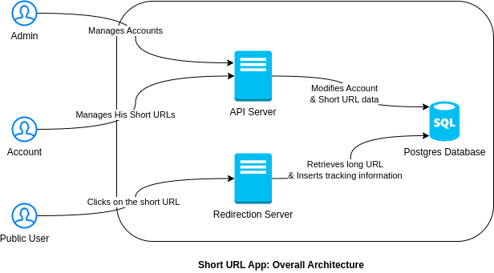

# Design and Architecture

## Architecture 
- There are 2 main components in this system
    - API Server
    - Redirection Server
- API Server is the main server that handle all the API requests from the admin or customers
- Redirection Server is the server that handle all the redirection requests from the public
- The separation between the two components has two benefits : 
    - The servers can be scaled independently of each other.
    - Security: The API server is not exposed to public users, it's only used by authenticated users. The redirection server is exposed to public users, it doesn't require authentication, but it doesn't modify customer and short URL data, it only reads data, and inserts tracking data.
- This architecture can later be deployed as microservices, where each component is a microservice.

<p align="center"></p>

## API Server
- The API server is the main server that handle all the API requests from the admin and customers.
- The API server is a REST API server, it's built using Golang & Swagger.
- The API server is stateless, it doesn't store any data, it only reads and writes data to the database.
- The API server is secured using API key. Each customer has an API key stored in the database, and the admin has a specific API key stored as an environment variable.

### API Endpoints
Here's a brief description of the API endpoints:
1. Create Customer:
   - Endpoint: `/api/customer/`
   - HTTP Method: POST
   - Header Parameters:
     - `X-API-KEY`: The admin API key.
   - Request JSON Structure:
     ```json
     {
       "username": "string", 
       "email": "string" 
     }
     ```
      - 'username' and 'email' are required and must be unique.

   - Response JSON Structure (on success):
     ```json
     {
       "api_key": "string",
     }
     ```
   - Response JSON Structure (on failure):
     ```json
     {
       "error": "string",
     }
     ```

2. Update Customer:
   - Endpoint: `/api/customer/`
   - HTTP Method: PUT
   - Header Parameters:
      - `X-API-KEY`: The admin API key.
   - Request JSON Structure:
     ```json
     {
       "username": "string",
       "status": "string" 
     }
     ```
     - 'username' is required.
     - 'status' is required and must be one of the possible values : "active" or "inactive".
   - Response JSON Structure (on success):
     ```json
     {
       "status": "string"
     }
     ```
   - Response JSON Structure (on failure):
     ```json
     {
       "error": "string",
     }
     ```

3. Create ShortURL:
   - Endpoint: `/api/short-url/`
   - HTTP Method: POST
   - Header Parameters:
     - `X-API-KEY`: The customer API key.
   - Request JSON Structure:
     ```json
     {
       "long_url": "string" 
     }
     ```
     - 'long_url' is required and must be a valid URL.
   - Response JSON Structure (on success):
     ```json
     {
       "short_url": "string"
     }
     ```
    - Response JSON Structure (on failure):
      ```json
      {
        "error": "string",
      }
      ```

4. Update ShortURL:
   - Endpoint: `/api/short-url/`
   - HTTP Method: PUT
   - Header Parameters:
      - `X-API-KEY`: The customer API key.
   - Request JSON Structure:
     ```json
     {
       "short_url": "string", 
       "new_long_url": "string", 
       "tracking_status": "string",
     }
     ```
     - 'short_url' is required.
     - 'new_long_url' is optional, if it's not provided, the long url will not be updated.
     - 'tracking_status' is optional, if it's not provided, the tracking status will not be updated. Possible values: "active", "inactive".
   - Response JSON Structure (on success):
     ```json
     {
       "status": "string"
     }
     ```
    - Response JSON Structure (on failure):
      ```json
      {
        "error": "string",
      }
      ```
### Example requests in curl 
  1. Create Customer:
  ```bash
  curl -X POST \
  -H "Content-Type: application/json" \
  -H "X-API-KEY: {admin_api_key}" \
  -d '{
    "username": "johnsmith",
    "email": "johnsmith@example.com"
  }' \
  https://your-domain.com/api/admin/customer/

  ```
  
  2. Update Customer:
  ```bash
  curl -X PUT \
  -H "Content-Type: application/json" \
  -H "X-API-KEY: {admin_api_key}" \
  -d '{
    "username": "johnsmith",
    "status": "inactive"
  }' \
  https://your-domain.com/api/admin/customer/
  ```
  
  3. Create ShortURL:
  ```bash
  url -X POST \
  -H "Content-Type: application/json" \
  -H "X-API-KEY: {admin_api_key}" \
  -d '{
    "username": "johnsmith",
    "email": "johnsmith@example.com"
  }' \
  https://your-domain.com/api/admin/customer/
  ```

  4. Update ShortURL:
  ```bash
  url -X POST \
  -H "Content-Type: application/json" \
  -H "X-API-KEY: {admin_api_key}" \
  -d '{
    "username": "johnsmith",
    "email": "johnsmith@example.com"
  }' \
  https://your-domain.com/api/admin/customer/
  ```
  Please note that you need to replace `{admin_api_key}` and `{customer_api_key}` with the actual API keys for authentication. Also, replace https://your-domain.com with the appropriate URL for your API endpoint.

## Redirection Server

## Database Design

## Code Structure
